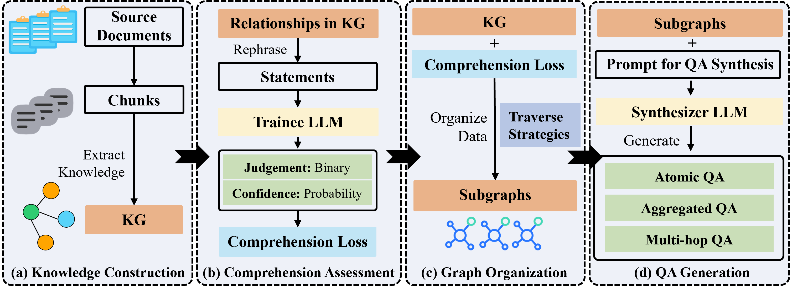

<p align="center">
  
</p>

<!-- icon -->

[](https://github.com/open-sciencelab/GraphGen)
[](https://github.com/open-sciencelab/GraphGen)
[](https://github.com/open-sciencelab/GraphGen/issues)
[](https://github.com/open-sciencelab/GraphGen/issues)

GraphGen: Enhancing Supervised Fine-Tuning for LLMs with Knowledge-Driven Synthetic Data Generation

<details open>
<summary><b>📚 Table of Contents</b></summary>

- 📝 [What is GraphGen?](#-what-is-graphgen)
- 🚀 [Quick Start](#-quick-start)
- 📌 [Latest Updates](#-latest-updates)
- 🌟 [Key Features](#-key-features)
- 🏗️ [System Architecture](#-system-architecture)
- ⚙️ [Configurations](#-configurations)
- 📅 [Roadmap](#-roadmap)
- 💰 [Cost Analysis](#-cost-analysis)

</details>

## 📝 What is GraphGen?

GraphGen is a framework for synthetic data generation guided by knowledge graphs. Here is our [**paper**](https://github.com/open-sciencelab/GraphGen/tree/main/resources/GraphGen.pdf).

It begins by constructing a fine-grained knowledge graph from the source text，then identifies knowledge gaps in LLMs using the expected calibration error metric, prioritizing the generation of QA pairs that target high-value, long-tail knowledge.
Furthermore, GraphGen incorporates multi-hop neighborhood sampling to capture complex relational information and employs style-controlled generation to diversify the resulting QA data. 

## 🚀 Quick Start

Experience it on the [OpenXLab Application Center](https://openxlab.org.cn/apps/detail/tpoisonooo/GraphGen) 

### Gradio Demo

   ```bash
   python webui/app.py
   ```


### Run from PyPI

1. Install GraphGen
   ```bash
   pip install graphg
   ```

2. Run in CLI
   ```bash
   SYNTHESIZER_MODEL=your_synthesizer_model_name \
   SYNTHESIZER_BASE_URL=your_base_url_for_synthesizer_model \
   SYNTHESIZER_API_KEY=your_api_key_for_synthesizer_model \
   TRAINEE_MODEL=your_trainee_model_name \
   TRAINEE_BASE_URL=your_base_url_for_trainee_model \
   TRAINEE_API_KEY=your_api_key_for_trainee_model \
   graphg --output_dir cache
   ```

### Run from Source

1. Install dependencies
    ```bash
    pip install -r requirements.txt
    ```
2. Configure the environment
   - Create an `.env` file in the root directory
     ```bash
     cp .env.example .env
     ```
   - Set the following environment variables:
     ```bash
     # Synthesizer is the model used to construct KG and generate data
     SYNTHESIZER_MODEL=your_synthesizer_model_name
     SYNTHESIZER_BASE_URL=your_base_url_for_synthesizer_model
     SYNTHESIZER_API_KEY=your_api_key_for_synthesizer_model
     # Trainee is the model used to train with the generated data
     TRAINEE_MODEL=your_trainee_model_name
     TRAINEE_BASE_URL=your_base_url_for_trainee_model
     TRAINEE_API_KEY=your_api_key_for_trainee_model
     ```
3. (Optional) If you want to modify the default generated configuration, you can edit the content of the configs/graphgen_config.yaml file.
    ```yaml
    # configs/graphgen_config.yaml
    # Example configuration
    data_type: "raw"
    input_file: "resources/examples/raw_demo.jsonl"
    # more configurations...
    ```
4. Run the generation script
   ```bash
   bash scripts/generate.sh
   ```
5. Get the generated data
   ```bash
   ls cache/data/graphgen
   ```

## 🏗️ System Architecture

### Directory Structure
```text
├── baselines/           # baseline methods
├── cache/               # cache files
│   ├── data/            # generated data
│   ├── logs/            # log files
├── configs/             # configuration files
├── graphgen/            # GraphGen implementation
│   ├── operators/       # operators
│   ├── graphgen.py      # main file
├── models/              # base classes
├── resources/           # static files and examples
├── scripts/             # scripts for running experiments
├── templates/           # prompt templates
├── utils/               # utility functions
├── webui/               # web interface
└── README.md
```

### Workflow



## 🍀 Acknowledgements
- [SiliconCloud](https://siliconflow.cn) Abundant LLM API, some models are free
- [LightRAG](https://github.com/HKUDS/LightRAG) Simple and efficient graph retrieval solution
- [ROGRAG](https://github.com/tpoisonooo/ROGRAG) ROGRAG: A Robustly Optimized GraphRAG Framework
